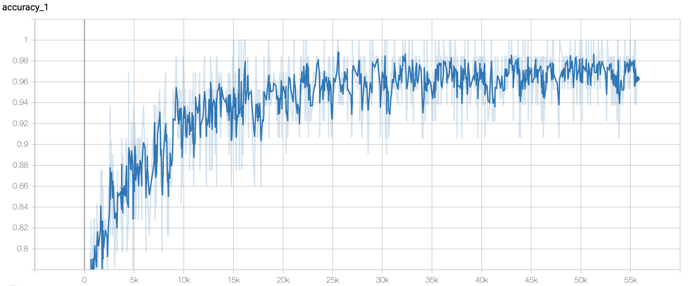
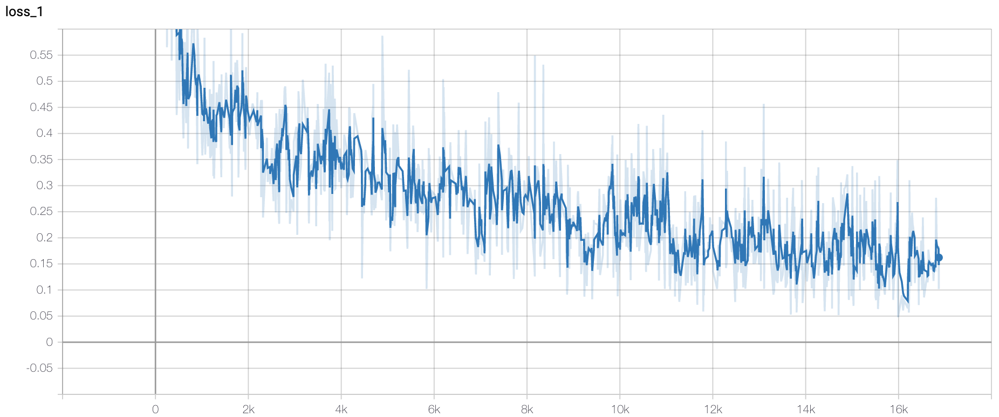
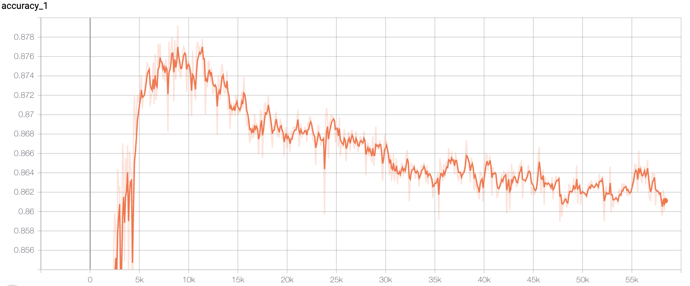
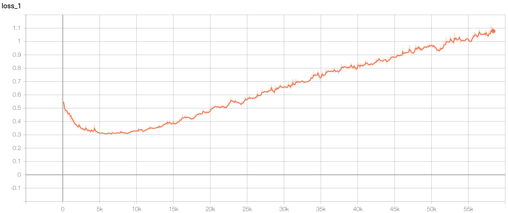

### Implementation

[Tensorflow](https://github.com/dennybritz/cnn-text-classification-tf)

### Hyperparameters

- num of epochs: 40
- test split ratio: 0.1
- others kept as same in `train.py`

### Result

**0.876** accuracy on dev set.

🚀Training Accuracy

🚀Training Loss

🚀Dev Accuracy

🚀Dev Accuracy

